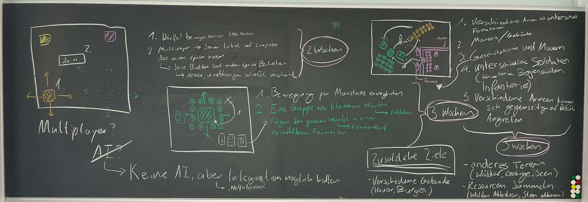
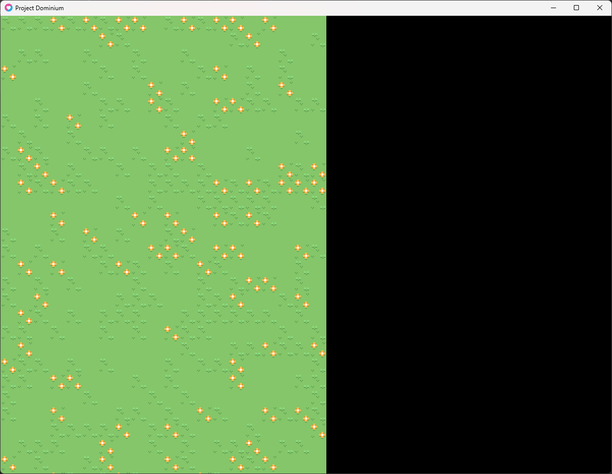
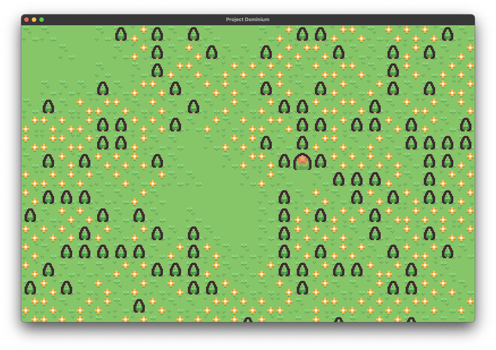

# Project Dominium - Project Documentation

## Table of contents

1. [Introduction](#introduction)
    1. [What and why?](#what-and-why)
    2. [Structuring and Formatting](#structuring-and-formatting)
2. [Project Documentation](#project-documentation)

## Introduction

### What and why?

As Project Dominium is a school project which is made for the subject called **Project and Research** *(Projekt und Recherche)*, there are of course certain restrictions, conditions and also extra tasks surrounding the creation of such a project.

As we almost have complete creative liberty in deciding the topic, timespan and format of our project, one of the few conditions include that we write a **Documentation**. Now, this is not a documentation in the sense of a documentation of the code, but a documentation of the process of creating, or in our case, developing this project. It should be on the more detailed end of things, and should go into most of the steps and resources we took and will use to achieve what we want to do, with it provided in an easily readable format, which will then get graded at the end of the project.

This file is that documentation.

### Structuring and Formatting

The main part of this document (the documentation itself) will be written in a weekly manner, for everyone in the team, no matter if they have done anything substantial in contributing to the development of the game or not.

The weekly report may be a short section of text, or a long and comprehensive description of all the weeks changes with screenshots and more, all depending on the amout of work that team member did that week.

The weekly report **always** at least contain:

- The name of the team member
- A few sentences on their contributions that week, or a short reason why if they didn't contribute anything. Most often than not a more formulated version of the team members commit messages for that week.
- **All** resources used that week, if not overlapping with the resources used in the last few weeks.

Here are a few examples:

- **Guy A** is developing a terrain generation algorithm. This may take multiple weeks. Hereby, the weekly report of the first few weeks will only consist of short sentences summarizing his current progress and status on the algorithm, maybe providing a few snippets of pseudocode here and there. But as soon as he is done, his next weekly report will consist of a detailed report on the workings and formulas involved in the algorithm, as well as a summary of all resources he used
- **Guy B** did some minor bugfixes. He summarizes all bugs fixed and maybe some comments on the details of the bug. In some cases he may also provide screenshots or video if it is a f.e. graphical glitch.
- **Guy C** Was texturing a new 3D model he was just provided with. He summarizes his rough progress on the texture and the steps left to completion, f.e. coloring, shading or polishing rough edges. He may also provide screenshots of the his work and the texture applied to its 3D model.
- **Guy D** did nothing this week due to various reasons. *Time Constraints* or *Appointments* are reason enough and the person should not have to go into further detail.

The weekly report will always be written and/or edited in following order by team member names *(alphabetical)*:

1. Finn Cibis
2. Sokol Biba
3. Xintian Geng
4. Zhile Zhu

The title of each week should contain the number of that week in the entire scope of the project and the date of its **Monday**. The date will be written in **Day/Month/Year**. All school holidays and public holidays will be also counted towards the development of the project.

Final editing to ensure that grammer, spelling and formatting stays same across all weeks across all team members will be done at the end of each week by Zhile Zhu.

## Project Documentation

### Week 1 (11/10/2023)

#### Finn Cibis

I continued programming a very basic game which I found online as an exercise, as well as doing some research, but nothing major was done to contribute to the project.

---

#### Sokol Biba

Father gave me some work to do, so nothing for the project was done.

---

#### Xintian Geng

Nothing was doe due to time constraints.

---

#### Zhile Zhu

As this is the first official week of development on the alpha stage, I will have the responsibility of developing the first stage of the project (as seen in the picture above).

This is how the program should look like at the end of the week:

1. Making a basic client-server program using LÖVE and luasocket.
    1. There can be up to 4 clients at once on a server.
    2. Clients can view each others username chosen before joining a server.
2. Randomly generate a very simple and basic background using a tilemap.
    1. The algorithm should be deterministic and seed-based.
    2. It should pick from a list of tiles and radomly place them in a map of given size.
    3. Render the tilemap.
3. Assigning and spawn a movable character of random color to each client upon joining, and destroy the character upon the client disconecting.
    1. The character can be moved with WSAD keys.
    2. All clients can observe each others characters on their screen moving about.
4. *(Optional)* When the player, whose computer is running the server quits, the server starts another instance on another players computer and shuts down, upon which all players will join the new server instance.

I will be making extensive use of the [LÖVE wiki](https://love2d.org/wiki/love) and the [official LÖVE tutorials](https://love2d.org/wiki/Category:Tutorials), especially the [networking chapter](https://love2d.org/wiki/Tutorial:Networking_with_UDP).

My first task would be to get a window with configuration up and running, which is pretty easy, so no need to go into further detail.

Next up, I downloaded some assets from [Kenney](https://kenney.nl) for this prototype, and I found the [Tiny Battle](https://kenney.nl/assets/tiny-battle) asset pack to be quite fitting.

Next up, I wrote a little code to enable me to generate a very simple tilemap, which works by inserting random elements of an array containing all available indexes into a tileset into a 2D array, and then rendering the array. There are a few smaller optimizations I made, but this is basically how this works. You can enter a seed and the width and height of the tilemap you want to generate, and then you can draw it.

This is how it looks like. Of course, the tilemap does not fill the entire screen, but you can always customise its width and height, so not a big issue.

The next step would be to implement [wave function collapse](https://en.wikipedia.org/wiki/Wave_function_collapse). For this, I will be using the video [Superpositions, Sudoku, the Wave Function Collapse algorithm](https://www.youtube.com/watch?v=2SuvO4Gi7uY) by [Martin Donald](https://www.youtube.com/@MartinDonald).

First off, I made some minor modifications to the tileset so that it has some blank spaces left, which will come in handy later on when we will start generating multiple layers of tilemaps.

Now it's time for wave function collapse.

This was suprisingly harder than I thought, taking me from wednesday to sunday to finish. But in the end, it turned out to be pretty alright, only having some minor issues, which are normal for a wfc-algorithm to have, like tedious inputs for tilesets and possible failstates, but it should work for this prototype.

---

### Week 2 (16/10/2023)

#### Finn Cibis

---

#### Sokol Biba

---

#### Xintian Geng

---

#### Zhile Zhu

---

